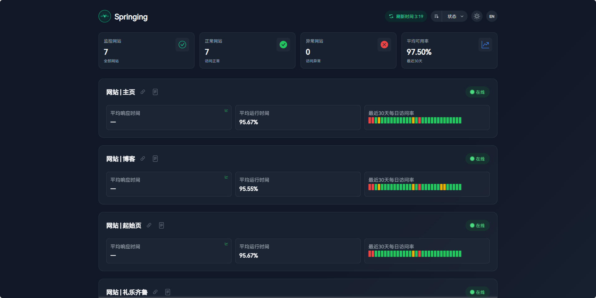

<p align="center">
  
</p>

<h1 align="center">站点监测</h1>

<p align="center">优雅的站点状态监控面板</p>

<p align="center">
  
  
  
</p>

<p align="center">🎮 在线演示：
  <a href="https://status.springing.top" target="_blank">
    https://status.springing.top
  </a>
</p>


## 简介

站点监测是一个基于 UptimeRobot **v3 API** 和<a href="https://github.com/JLinmr/uptime-status" target="_blank">Status Monitor </a>二次开发的站点状态监控面板，支持多站点状态监控、故障统计等功能。界面简洁美观，响应式设计，支持亮暗主题切换。

> **升级提示**：UptimeRobot 已停用旧版 v2 接口（`.../v2/getMonitors`）。若你仍在使用旧版代码，请拉取最新版本并重新部署，否则会出现加载失败或请求超时。



## 功能
本项目基于<a href="https://github.com/JLinmr/uptime-status" target="_blank">Status Monitor </a>进行了如下的二次开发
✅网站排列样式重构
✅故障记录功能重构
✅增加日访问热力图
✅增加站点状态徽标


## ⚙️ 部署配置

### 环境要求

- Node.js >= 16.16.0
- NPM >= 8.15.0 或 PNPM >= 8.0.0

### 获取 UptimeRobot API Key

1. 注册/登录 [UptimeRobot](https://uptimerobot.com/)
2. 进入 [Integrations & API](https://dashboard.uptimerobot.com/integrations)
3. 下拉到最底部在 Main API keys 部分创建 **Read-Only API Key**
4. 复制生成的 API Key

### API 代理说明

本项目支持以下三种部署方式,均可实现自动处理跨域请求:

1. **腾讯云 EdgeOne Pages**
   - 点击上方蓝色 "Deploy" 按钮
   - 连接到GitHub，选择项目
   - 框架预设选择Vue，点击开始部署
   - 使用默认配置 `VITE_UPTIMEROBOT_API_URL = "/api/status"`

2. **Vercel**
   - 点击上方黑色 "Deploy" 按钮
   - 连接到GitHub，选择项目
   - 填写项目名称，点击Create
   - 使用默认配置 `VITE_UPTIMEROBOT_API_URL = "/api/status"`

3. **Cloudflare Pages**
   - 点击上方橙色 "Deploy" 按钮
   - 找到计算(worker) 部分
   - 点击创建，选择Pages，连接到GitHub，选择项目，点击开始创建
   - 框架预设选择Vue，点击保持并部署
   - 使用默认配置 `VITE_UPTIMEROBOT_API_URL = "/api/status"`

4. **其他平台**
   - 自行搭建 API 代理，代理目标为 `https://api.uptimerobot.com/v3`
   - 在 `.env` 文件中设置 `VITE_UPTIMEROBOT_API_URL` 为你的 API 代理地址

### 快速开始

1. 克隆项目
```bash
git clone https://github.com/JLinmr/uptime-status.git
cd uptime-status
```

2. 安装依赖
```bash
pnpm install
# 或
npm install
```

3. 配置环境变量

在 `.env` 文件中修改以下配置：
```bash
# UptimeRobot API Key（Read-Only 即可）
VITE_UPTIMEROBOT_API_KEY = "你的 API Key"

# UptimeRobot API URL
# 部署到 Vercel / Cloudflare Pages / EdgeOne 等平台时使用：
VITE_UPTIMEROBOT_API_URL = "/api/status"

# 本地开发直连 v3 时可改为：
# VITE_UPTIMEROBOT_API_URL = "https://api.uptimerobot.com/v3"

# 站点名称
VITE_APP_TITLE = "梦爱吃鱼"
```

> 已移除 `VITE_UPTIMEROBOT_STATUS_SORT` 配置项，排序请在页面右上角选择，偏好会自动保存到浏览器。

4. 开发调试
```bash
pnpm dev
# 或
npm run dev
```

5. 构建部署
```bash
pnpm build
# 或
npm run build
```
构建的文件在 `dist` 目录下，将 `dist` 目录部署到服务器即可。
